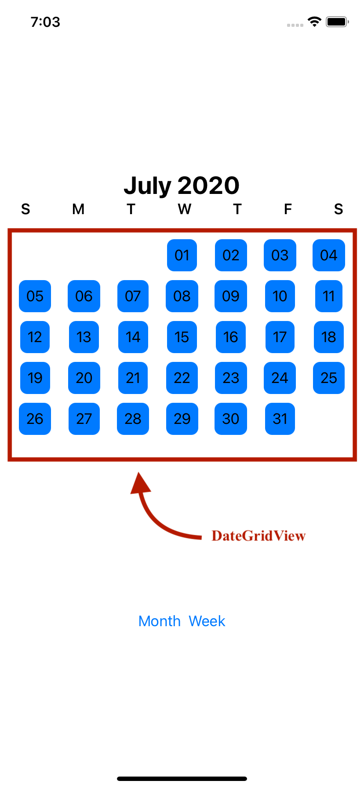
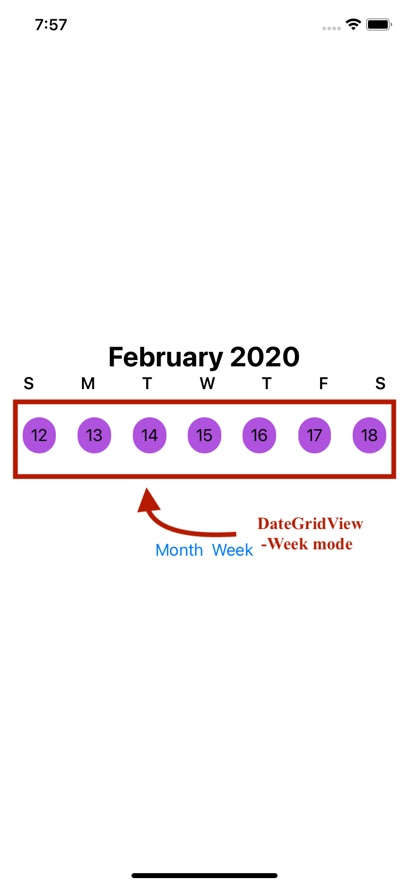

<p align="center">

</p>

<p align="center">
<a href="https://swift.org/package-manager/"></a>
</p>

Description not available.

## Installation
From Xcode 11, you can use Swift Package Manager to add DateGrid to your project.

1. Select File > Swift Packages > Add Package Dependency. Enter ``` https://github.com/yodagamaheshan/DateGrid.git```  in the "Choose Package Repository" dialog.
1. In the next page, specify the version resolving rule.
1. After Xcode checking out the source and resolving the version, you can choose the "DateGrid" library and add it to your app target.

## Usage

```swift
DateGrid(interval: dateInterval , selectedMonth: $selectedMonthDate, mode: mode) { dateGridDate in
                
                Text(dateGridDate.date.day)
                    .padding(8)
                    .background(Color.blue)
                    .cornerRadius(8)
                    .padding([.bottom], 10)
            }
```


[Sample project](https://github.com/yodagamaheshan/FlexibleCalender-demo.git)

<p>   
    
</p>
